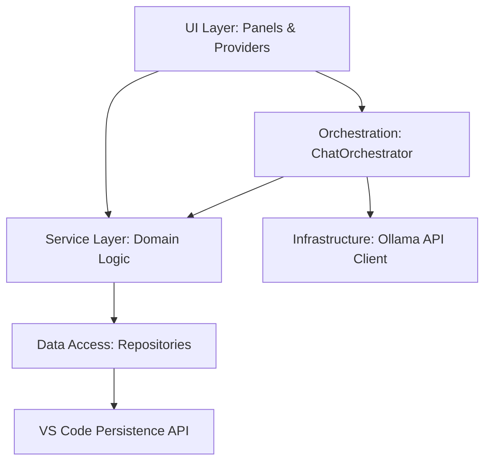

# Contributing to Ollama View

Thank you for your interest in contributing to Ollama View! We welcome contributions from the community.

## Prerequisites

- **Node.js**: v18.x or higher
- **Ollama**: Installed and running locally (`ollama serve`)
- **Visual Studio Code**: Recommended editor

## Development Setup

1.  **Clone the repository**:

    ```bash
    git clone https://github.com/oswaldo/ollama-view.git
    cd ollama-view
    ```

2.  **Install dependencies**:

    ```bash
    npm install
    ```

3.  **Run the Extension**:
    - Open the project in VS Code.
    - Press `F5` to open a new Extension Development Host window.
    - The extension will be active in the new window.

## Testing

We use `mocha` for testing.

- **Run unit tests**:
    ```bash
    npm test
    ```
- **Run integration tests** (requires local Ollama running):
    ```bash
    npm run test:integration
    ```
- **Linting**:
    ```bash
    npm run lint
    ```

## Coding Guidelines

- **Style**: We use `Prettier` for formatting. Please ensure your code is formatted before submitting.
    ```bash
    npx prettier --write .
    ```
- **Linting**: We use strict ESLint rules. Ensure there are no linting errors.

## Submitting Pull Requests

1.  Fork the repository.
2.  Create a new branch for your feature or fix.
3.  Commit your changes with clear messages.
4.  Push to your fork and submit a Pull Request.

## License

By contributing, you agree that your contributions will be licensed under the MIT License.

## Architecture

The extension follows a clean, layered architecture to ensure maintainability and testability.



- **Contract Layer**: Defines stable interfaces for infrastructure (API, Storage).
- **Data Access Layer**: Handles persistence using VS Code's `globalState`.
- **Service Layer**: Encapsulates pure domain logic and business rules.
- **Orchestration Layer**: Coordinates complex flows (e.g., chat generation) across services.
- **UI Layer**: Managed via VS Code Webviews and Tree Data Providers.
