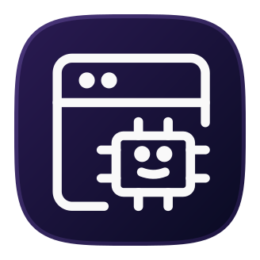
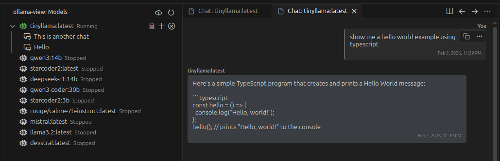

    
    <h1>Ollama View for VS Code</h1>

Manage your locally installed [Ollama](https://ollama.ai) models directly from Visual Studio Code.

## Features

- **Dashboard View**: See all your pulled models in the sidebar.
- **Status Indicators**: Custom indicators show which models are loaded or stopped.
- **Controls**:
    - **Start**: Load a model into memory.
    - **Stop**: Unload a model to free up RAM.
    - **Delete**: Remove a model from your disk (with confirmation).
- **Pull Models**: Easily download new models (e.g., `llama3`, `mistral`) via command.
- **Context-Aware Commands**: Run Start/Stop/Delete from the Command Palette (`Ctrl+Shift+P`) to see a interactive list of models if you haven't selected one in the view.

## Requirements

- [Ollama](https://ollama.ai) must be installed and running locally.
- By default, it connects to `http://127.0.0.1:11434`.

## Commands

- `ollama-view: Refresh`: Refresh the model list.
- `ollama-view: Pull Model`: Download a new model.
- `ollama-view: Start`: Start a model (context-aware).
- `ollama-view: Stop`: Stop a running model (context-aware).
- `ollama-view: Delete`: Delete a model (context-aware).

## Known Issues

- Autocomplete for model names during "Pull" is limited to a popular subset. You can still type any model name manually.

## Release Notes

### 0.0.1

- Initial release with View, Start, Stop, Delete, and Pull functionalities.
