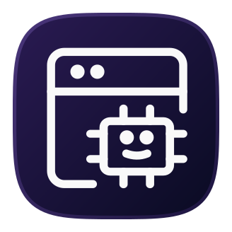
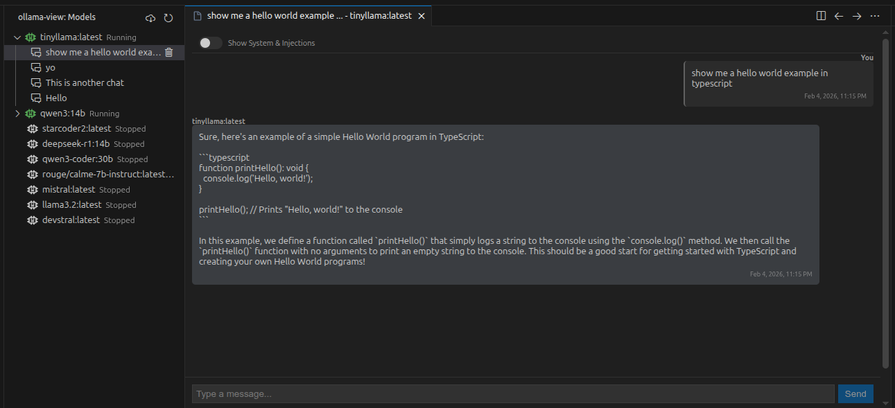
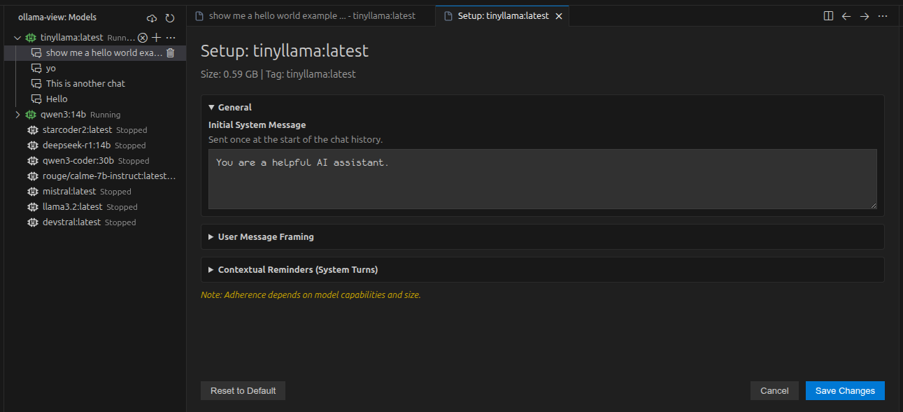

    
    <h1>Ollama View for VS Code</h1>

Execute your local LLMs directly inside the IDE with **zero context switching**. Manage, configure, and chat with your [Ollama](https://ollama.ai) models while maintaining absolute **data privacy and sovereignty** (your content never leaves your machine).

🎉 **Thank you for checking it out!** I feel honored that *Ollama View* has more than **9,000 downloads** across marketplaces, before I even had a chance to properly announce it! 🎉

> **Note**: This is an experimental project developed in my free time. While you might encounter some dragons along the way, you are highly encouraged to open issue tickets on GitHub if you find bugs or have feature requests. I'll do my best to take a look when I can!

<table align="center">
  <tr>
    <td align="center" width="50%">
       
      <b>Interactive Chat</b>
    </td>
    <td align="center" width="50%">
       
      <b>Advanced Model Setup</b>
    </td>
  </tr>
</table>

## Installation

You can install this extension from the following sources:

- **[VS Code Marketplace](https://marketplace.visualstudio.com/items?itemName=OswaldoDantas.ollama-view)**: Official release.
- **[Open VSX Registry](https://open-vsx.org/extension/OswaldoDantas/ollama-view)**: For Codium and other editors.
- **[GitHub Releases](https://github.com/oswaldo/ollama-view/releases)**: Download the `.vsix` file manually.

## Features

### Sidepanel View

- **Dynamic Model List**: View all your local Ollama models in a hierarchical tree view, grouping instances and chats.
- **Model Instances**: Create multiple named instances of the same model with distinct configurations.
- **Pull Models**: Easily download new models (e.g., `llama3`, `mistral`) via command.
- **Status Indication**: Visual indicators for Running (Green) and Stopped (Grey) models.
- **Persistent Chats**: Create and manage multiple persistent chats for each model.
- **Advanced Setup**: Configure model-specific system messages, prompt injection templates (prefix/suffix framing), and performance controls (temperature, seed, top-p, etc.).
- **Context Menu**: Safe model deletion and configuration access via the "More Actions" menu.

### Chat Interface

- **Concurrent Chats**: Open multiple chat tabs simultaneously.
- **History**: Chat history is automatically saved and persists across VS Code sessions.
- **Auto-Start**: Sending a message to a stopped model continuously starts it.
- **Message Editing**: Hover over user messages to **copy** content or access **edit options**:
    - **Edit / Truncate**: Edit a message and remove all subsequent history (rewriting the conversation path).
    - **Edit / Fork**: Edit a message and create a new chat branch, preserving the original conversation.
- **Model Actions**: Hover over model responses to:
    - **Copy**: Copy response content to clipboard.
    - **Regenerate**: Re-generate the answer. If it's not the last message, this will truncate the conversation.
    - **Fork**: Create a new chat branching from this point.
- **Prompt Debugging**: Visibility toggle to show/hide "hidden" system turns and prompt injections in the chat history.
- **Context-Aware Commands**: Run Start/Stop/Delete from the Command Palette (`Ctrl+Shift+P`) to see a interactive list of models if you haven't selected one in the view.

## Architecture

If you are interested in how the extension is built or want to contribute, please check out our [Contributing Guidelines and Architecture overview](https://github.com/oswaldo/ollama-view/blob/main/CONTRIBUTING.md#architecture).

## Requirements

- [Ollama](https://ollama.ai) must be installed and running locally.
- By default, it connects to `http://127.0.0.1:11434`.

> **Note**: This project has been tested primarily on **Linux**. It assumes [Ollama](https://ollama.ai) is already installed and running correctly on your system. Compatibility with other OSs is expected but not yet verified.

## Commands

- `ollama-view: Refresh`: Refresh the model list.
- `ollama-view: Pull Model`: Download a new model.
- `ollama-view: Start`: Start a model (context-aware).
- `ollama-view: Stop`: Stop a running model (context-aware).
- `ollama-view: Delete`: Delete a model (context-aware).

## Known Issues

- Autocomplete for model names during "Pull" is limited to a popular subset. You can still type any model name manually.

## Roadmap & Community Input

I'm constantly improving the extension mostly based on my experiments and needs, but feel free to suggest new features or report issues on the [GitHub Issues](https://github.com/oswaldo/ollama-view/issues) page. My current focus areas for upcoming releases include:

- **Chat Export/Import**: Capabilities to easily export and import existing chat histories.
- **Context Manipulation**: Experimenting with ways to allow users to manually override past messages, exploring how altering the historical context shifts the model's follow-up responses.

## Support & Feedback

If you encounter a bug, have a feature request, or just want to discuss an idea, please open a [GitHub Issue](https://github.com/oswaldo/ollama-view/issues). Community feedback is essential in driving the direction of this project!

## Support the Project

If you find `ollama-view` useful in your daily workflow, please consider [starring the repository on GitHub](https://github.com/oswaldo/ollama-view) ⭐️. Your support means a lot and helps other users find the project!

 

  Made with ❤️ in Hamburg ⚓

