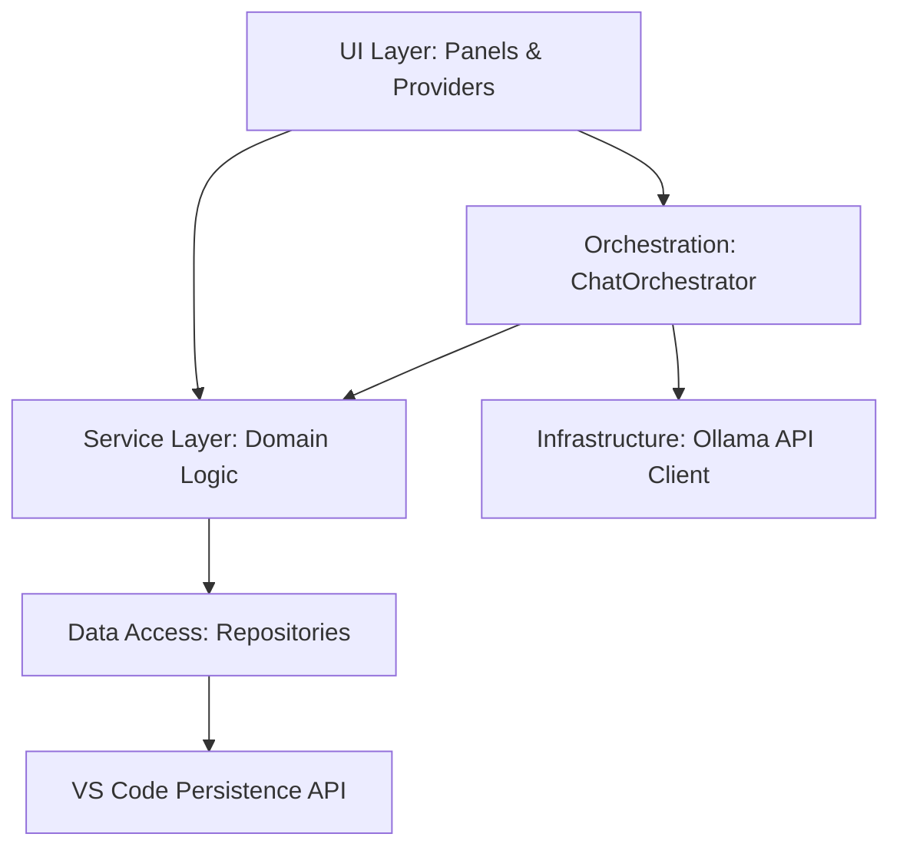

    
    <h1>Ollama View for VS Code</h1>

Manage your locally installed [Ollama](https://ollama.ai) models directly from Visual Studio Code.

(Experimental) Start quick experiments by chatting directly with your models.

> **Note**: This is an experimental project developed in my free time. While you might encounter some dragons along the way, you are highly encouraged to open issue tickets on GitHub if you find bugs or have feature requests. I'll do my best to take a look when I can!

<table align="center">
  <tr>
    <td align="center" width="50%">
       
      <b>Interactive Chat</b>
    </td>
    <td align="center" width="50%">
       
      <b>Advanced Model Setup</b>
    </td>
  </tr>
</table>

## Installation

You can install this extension from the following sources:

- **[VS Code Marketplace](https://marketplace.visualstudio.com/items?itemName=OswaldoDantas.ollama-view)**: Official release.
- **[Open VSX Registry](https://open-vsx.org/extension/OswaldoDantas/ollama-view)**: For Codium and other editors.
- **[GitHub Releases](https://github.com/oswaldo/ollama-view/releases)**: Download the `.vsix` file manually.

## Features

### Sidepanel View

- **Dynamic Model List**: View all your local Ollama models in a hierarchical tree view, grouping instances and chats.
- **Model Instances**: Create multiple named instances of the same model with distinct configurations.
- **Pull Models**: Easily download new models (e.g., `llama3`, `mistral`) via command.
- **Status Indication**: Visual indicators for Running (Green) and Stopped (Grey) models.
- **Persistent Chats**: Create and manage multiple persistent chats for each model.
- **Advanced Setup**: Configure model-specific system messages, prompt injection templates (prefix/suffix framing), and performance controls (temperature, seed, top-p, etc.).
- **Context Menu**: Safe model deletion and configuration access via the "More Actions" menu.

### Chat Interface

- **Concurrent Chats**: Open multiple chat tabs simultaneously.
- **History**: Chat history is automatically saved and persists across VS Code sessions.
- **Auto-Start**: Sending a message to a stopped model continuously starts it.
- **Message Editing**: Hover over user messages to **copy** content or access **edit options**:
    - **Edit / Truncate**: Edit a message and remove all subsequent history (rewriting the conversation path).
    - **Edit / Fork**: Edit a message and create a new chat branch, preserving the original conversation.
- **Model Actions**: Hover over model responses to:
    - **Copy**: Copy response content to clipboard.
    - **Regenerate**: Re-generate the answer. If it's not the last message, this will truncate the conversation.
    - **Fork**: Create a new chat branching from this point.
- **Prompt Debugging**: Visibility toggle to show/hide "hidden" system turns and prompt injections in the chat history.
- **Context-Aware Commands**: Run Start/Stop/Delete from the Command Palette (`Ctrl+Shift+P`) to see a interactive list of models if you haven't selected one in the view.

## Architecture

The extension follows a clean, layered architecture to ensure maintainability and testability.

```mermaid
graph TD
    UI[UI Layer: Panels & Providers] --> Orch[Orchestration: ChatOrchestrator]
    UI --> Srv[Service Layer: Domain Logic]
    Orch --> Srv
    Orch --> Client[Infrastructure: Ollama API Client]
    Srv --> Repo[Data Access: Repositories]
    Repo --> VSCode[VS Code Persistence API]
```

- **Contract Layer**: Defines stable interfaces for infrastructure (API, Storage).
- **Data Access Layer**: Handles persistence using VS Code's `globalState`.
- **Service Layer**: Encapsulates pure domain logic and business rules.
- **Orchestration Layer**: Coordinates complex flows (e.g., chat generation) across services.
- **UI Layer**: Managed via VS Code Webviews and Tree Data Providers.

## Requirements

- [Ollama](https://ollama.ai) must be installed and running locally.
- By default, it connects to `http://127.0.0.1:11434`.

> **Note**: This project has been tested primarily on **Linux**. It assumes [Ollama](https://ollama.ai) is already installed and running correctly on your system. Compatibility with other OSs is expected but not yet verified.

## Commands

- `ollama-view: Refresh`: Refresh the model list.
- `ollama-view: Pull Model`: Download a new model.
- `ollama-view: Start`: Start a model (context-aware).
- `ollama-view: Stop`: Stop a running model (context-aware).
- `ollama-view: Delete`: Delete a model (context-aware).

## Known Issues

- Autocomplete for model names during "Pull" is limited to a popular subset. You can still type any model name manually.

## Release Notes

### 0.1.0 - Architecture Refactor, Advanced Config & Model Instances

- **Advanced Model Configuration**: Create and manage multiple named instances of the same model.
- **Performance Controls**: Adjust temperature, top-k, top-p, and random seed parameters per instance.
- **Dynamic Tree Hierarchy**: The sidebar now visually groups chats and instances under their parent models.
- **Welcome Screen**: Added an onboarding and "What's New" tab for a smoother user installation experience.
- **E2E Testing & Refactor**: Complete architectural overhaul with robust type-safety and comprehensive UI/E2E test suite coverage.
- **UI Polish**: Dozens of quality-of-life improvements including raw message inspection, better spacing, and individual chat resets.

### 0.0.6 - Model Framing & Chat Overrides

- **Model Framing View**: A new dedicated sidebar view to create, edit, duplicate, and manage reusable model framings (prefixes, suffixes, and system prompts).
- **Chat-Level Overrides**: Customize and override model framing on a per-chat or per-message basis for tailored interactions.
- **Message Info Modal**: Inspect turn-specific metadata and framing context for any message.
- **Robust History Manipulation**: Enhanced state preservation during chat branching (forking/truncating) with atomic metadata management.

### 0.0.5 - Marketplace Compatibility

- **Publishing Fix**: Corrected extension categories to comply with VS Code Marketplace requirements.

### 0.0.4 - Model Setup & Advanced Prompting

- **Model Setup**: New configuration screen to define system messages and message framing (prefixes/suffixes).
- **Prompt Injections**: Support for per-message system turns and user message wrapping.
- **Visibility Toggle**: View hidden system instructions directly in the chat panel.
- **UI Safety**: Moved destructive "Delete" action to a context menu.

### 0.0.3 - Unique Chat Naming

- **Unique Chat Names**: New chats now have unique names (e.g. "New Chat (2)") to prevent confusion.
- **Improved Naming Logic**: Renaming and forking chats also ensures unique names.
- **Tests**: Added tests for chat naming logic.

### 0.0.2 - Initial Chat Functionality

- **Persistent Chats**: Conversations are now possible and persistent across sessions.
- **Message Editing**: Edit user messages to branch conversation paths (Truncate or Fork).
- **Model Actions**: Copy, regenerate, and fork directly from model responses.
- **Enhanced UI**: Improved tree view, chat deletion flow, and timestamp formatting.

### 0.0.1 - Foundations

- Initial release with View, Start, Stop, Delete, and Pull functionalities.
